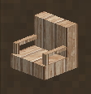

#  Wood Furniture

Adds new types of wood furniture 
 
## Information

Mod Type: Content 

**Asset Types**

- Blocktype: used to define blocks in the game
- Lang: used by the game to define names and descriptions
- Shapes: can be used by blocktypes to add shapes to blocks
 
## Tutorial

This mod is part of 'VS Mods for Noobs', a guide to learning how to mod for VS from scratch

This example demonstrates:

1. Adding an Block to the Game
2. Adding a new block in a custom asset namespace
3. Adding shapes to blocks
4. Adding Names/Labels to blocks

### Tips & Tricks

- Resources are namespaced according to the name of the directory in assets
- Names of blocks in games have language identifiers that must be targeted in the lang folder e.g. block-myitemname
- blocktype loads wood types properties from ./assets/survival/worldproperties/block/wood.json
- selection, collision:y2 = height/16

## Credits & References

- Based on https://wiki.vintagestory.at/index.php/Modding:Basic_Item
- ./Vintagestory/assets/survival/blocktypes/roofing/slantedroofing.json
- ./Vintagestory/assets/survival/blocktypes/wood/woodtyped/plankstairs.json
- ./Vintagestory/assets/survival/blocktypes/wood/table.json